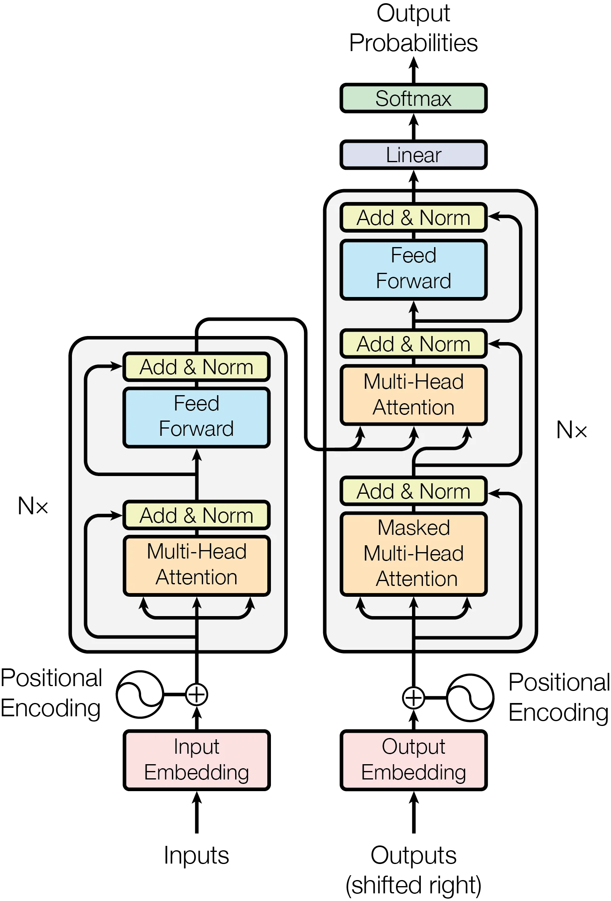
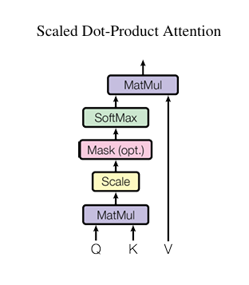
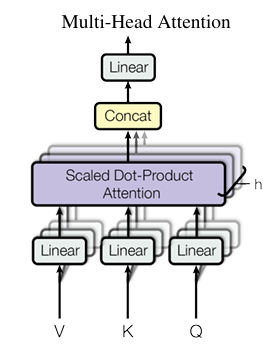
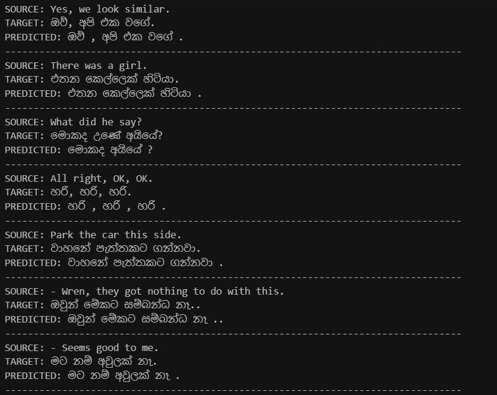
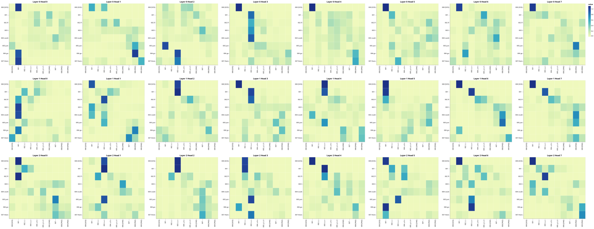
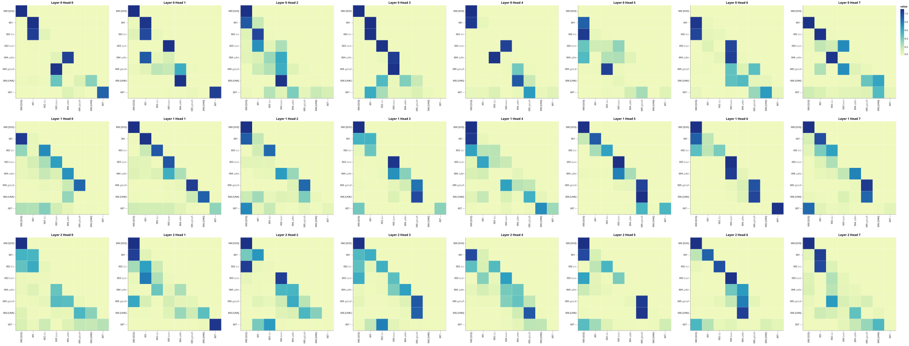
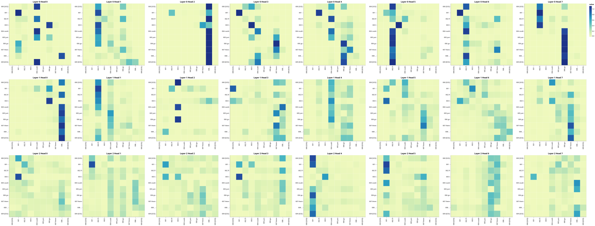

# English-to-Sinhala Neural Machine Translation Using Transformer

A from-scratch implementation of the **Transformer architecture** using Python for **English-to-Sinhala Neural Machine Translation (NMT)**.

This project is based on the Transformer architecture introduced in the paper **[Attention Is All You Need](https://arxiv.org/abs/1706.03762)** by Vaswani et al. (2017).

---

## 📌 Overview

The Transformer is an encoder-decoder neural network architecture based entirely on attention mechanisms. Unlike traditional sequence-to-sequence models, it does not rely on recurrent or convolutional layers.

This project implements the main components of the Transformer architecture **from scratch in PyTorch** and applies the model to English-to-Sinhala translation.

### Key Components

* Encoder and Decoder
* Scaled Dot-Product Attention
* Multi-Head Attention
* Positional Encoding
* Position-wise Feed-Forward Networks
* Residual Connections
* Layer Normalization
* Masked Self-Attention
* Encoder-Decoder Attention
* Custom Tokenization
* Training and Validation Pipeline
* Autoregressive Translation Inference
* Attention Weight Visualization

---

## 🧠 Transformer Architecture

The Transformer consists of an **encoder** and a **decoder**, each constructed from a stack of identical layers.

The original Transformer architecture uses:

* 6 encoder layers
* 6 decoder layers
* Multi-head attention
* Position-wise feed-forward networks
* Residual connections
* Layer normalization

<p align="center" style="background-color: white; padding: 20px;">
  
  <br>
  <font color="black">
    <em><b>Figure 1:</b> Transformer model architecture.</em>
  </font>
</p>

### Scaled Dot-Product Attention

The attention mechanism is defined as:

$$
{Attention}(Q,K,V) ={softmax}
\left(
\frac{QK^{T}}{\sqrt{d_k}}
\right)V
$$

where:

- $Q$ = Queries
- $K$ = Keys
- $V$ = Values
- $d_k$ = Dimension of the key vectors

<p align="center" style="background-color: white; padding: 20px;">
  
  <br>
  <font color="black">
    <em><b>Figure 2:</b> Scaled dot-product attention mechanism.</em>
  </font>
</p>

### Multi-Head Attention

Multi-head attention applies the attention mechanism in parallel using multiple learned projections:

$$
\operatorname{MultiHead}(Q,K,V)
=
\operatorname{Concat}(\operatorname{head}_1,\ldots,\operatorname{head}_h)W^O
$$

where:

$$
\operatorname{head}_i
=
\operatorname{Attention}
\left(
QW_i^Q,
KW_i^K,
VW_i^V
\right)
$$

<p align="center" style="background-color: white; padding: 20px;">
  
  <br>
  <font color="black">
    <em><b>Figure 3:</b> Multi-head attention mechanism.</em>
  </font>
</p>

Multi-head attention enables the model to capture different relationships between tokens and representations.

---

## 📐 Positional Encoding

Since the Transformer does not use recurrence, positional encoding is added to the token embeddings to provide information about the position of each token.

The sinusoidal positional encoding used in the original Transformer is:

$$
PE_{(pos,2i)}
=
\sin
\left(
\frac{pos}{10000^{2i/d_{\text{model}}}}
\right)
$$

$$
PE_{(pos,2i+1)}
=
\cos
\left(
\frac{pos}{10000^{2i/d_{\text{model}}}}
\right)
$$

---

## 🔄 Attention Mechanisms

The Transformer uses three main attention mechanisms.

### 1. Encoder Self-Attention

Each position in the input sequence can attend to all other positions in the same sequence.

### 2. Masked Decoder Self-Attention

The decoder can attend only to previously generated tokens. A causal mask prevents the model from accessing future tokens during training and inference.

### 3. Encoder-Decoder Attention

The decoder attends to the representations generated by the encoder. This allows the decoder to use information from the source English sentence while generating the Sinhala translation.

---

## 📊 Dataset

This project uses the **English-Sinhala conversational translation dataset**:

**`SAWithanage/en-si-translation-opus-conversational-4k`**

The dataset is available through the Hugging Face Datasets platform.

[Hugging Face Dataset: SAWithanage/en-si-translation-opus-conversational-4k](https://huggingface.co/datasets/SAWithanage/en-si-translation-opus-conversational-4k?utm_source=chatgpt.com)

The dataset contains approximately **4,000 English-Sinhala parallel translation pairs** designed for conversational translation. Each example consists of an English source sentence and its corresponding Sinhala translation.

The parallel data is used to train the Transformer to learn a mapping:

```text
English sentence → Sinhala sentence
```

The dataset is split into training and validation portions before model training.

### Example

```text
English:
I am a student.

Sinhala:
මම ශිෂ්‍යයෙක් වෙමි.
```

---

## 🔤 Tokenization

Custom tokenizers are built using the Hugging Face `tokenizers` library.

Separate tokenizers are used for the English and Sinhala languages.

The following special tokens are used:

```text
[UNK]  - Unknown token
[PAD]  - Padding token
[SOS]  - Start of sentence
[EOS]  - End of sentence
```

These tokens are used to prepare sequences for encoder input, decoder input, and target labels.

---

## 📂 Project Structure

```text
.
├── config.py                  # Model and training configuration
├── dataset.py                 # Dataset preparation and masking
├── model.py                   # Transformer architecture
├── train.py                   # Training pipeline
├── translate.py               # Translation utility
├── beam_search.py             # Beam search decoding
│
├── inference.ipynb            # Translation inference experiments
├── model_train.ipynb          # Model training experiments
├── attention_visual.ipynb     # Attention visualization
│
├── images/                    # Repository images and visualizations
├── weights/                   # Trained model weights
│
├── .gitignore
├── .python-version
├── pyproject.toml
├── uv.lock
└── README.md
```

---

## ⚙️ Technologies

* Python
* PyTorch
* Hugging Face Datasets
* Hugging Face Tokenizers
* TensorBoard
* uv

---

## 🚀 Installation

### 1. Clone the Repository

```bash
git clone https://github.com/dileek12/english-sinhala-transformer.git
cd English-sinhala-transformer
```

### 2. Install uv

If `uv` is not already installed:

```bash
pip install uv
```

### 3. Install Dependencies

Create the virtual environment and install the project dependencies:

```bash
uv sync
```

The project uses `pyproject.toml` for dependency configuration and `uv.lock` to maintain reproducible package versions.

---

## 🏋️ Training

Train the Transformer model using:

```bash
uv run python train.py
```

The training pipeline performs the following steps:

1. Loads the English-Sinhala parallel dataset.
2. Builds or loads the tokenizers.
3. Prepares the training and validation datasets.
4. Creates the Transformer model.
5. Trains the model.
6. Saves model checkpoints.
7. Logs training metrics using TensorBoard.

Training progress can be monitored using TensorBoard.

```bash
tensorboard --logdir runs
```

---

## 🔎 Inference

After training, translations can be generated using:

```bash
uv run python inference.py
```

The inference process generates Sinhala tokens autoregressively until the `[EOS]` token is produced.

### Example Translation

```text
English:
I am a student.

Predicted Sinhala:
මම ශිෂ්‍යයෙක් වෙමි.
```

Additional translation examples from the trained model are presented in the **Results** section.

---

# 📈 Results

The trained Transformer was evaluated qualitatively using English sentences from the translation task.

The results demonstrate that the model can learn English-to-Sinhala sequence-to-sequence translation and generate Sinhala sentences from previously unseen English inputs.

## Translation Examples

<p align="center">
  
  <br>
  <em><b>Figure 4:</b> Example English-to-Sinhala translation results produced by the trained Transformer.</em>
</p>

---

## 👁️ Attention Visualization

One of the main advantages of implementing the Transformer from scratch is the ability to inspect the attention weights produced by the model.

Attention visualizations provide an intuitive view of which source tokens the model focuses on while processing and generating translations.

### Encoder Self-Attention

The encoder self-attention visualization shows how English tokens attend to other tokens in the source sentence.

<p align="center">
  
  <br>
  <em><b>Figure 5:</b> Encoder self-attention visualization.</em>
</p>

### Decoder Self-Attention

The decoder uses masked self-attention so that each position can attend only to previously generated tokens.

<p align="center">
  
  <br>
  <em><b>Figure 6:</b> Masked decoder self-attention visualization.</em>
</p>

### Encoder-Decoder Attention

The encoder-decoder attention visualization shows how the Sinhala decoder attends to the English source sequence during translation.

<p align="center">
  
  <br>
  <em><b>Figure 7:</b> Encoder-decoder attention visualization during English-to-Sinhala translation.</em>
</p>

These visualizations help demonstrate how different attention heads learn relationships between source and target tokens.

---

## 📦 Model Weights

Trained model weights are not included in the repository to keep the repository lightweight.

The following files and directories are excluded through `.gitignore`:

```text
weights/
*.pt
*.pth
*.ckpt
```

If required, trained weights can be stored separately and loaded during inference.

---

## 🎯 Main Objective

The main objective of this project is to design and implement an **English-to-Sinhala Neural Machine Translation (NMT) system** using the Transformer architecture built from scratch with PyTorch.

The project aims to develop a model capable of learning meaningful relationships between English source sentences and their corresponding Sinhala translations using an encoder-decoder architecture based entirely on attention mechanisms.

The implementation focuses on:

* Developing an end-to-end English-to-Sinhala machine translation pipeline
* Implementing the Transformer architecture from scratch using PyTorch
* Training the model on an English-Sinhala parallel dataset
* Generating Sinhala translations from English input sentences
* Applying self-attention and multi-head attention to capture relationships between words
* Using positional encoding to preserve sequence order
* Applying causal masking during target sequence generation
* Exploring encoder, decoder, and encoder-decoder attention mechanisms
* Visualizing and interpreting attention weights produced during translation

The final system demonstrates how the Transformer architecture can be effectively applied to the task of **English-to-Sinhala Neural Machine Translation**, while providing insight into the internal attention mechanisms involved in the translation process.


---

## 📖 References

### Transformer

Vaswani, A., Shazeer, N., Parmar, N., Uszkoreit, J., Jones, L., Gomez, A. N., Kaiser, Ł., & Polosukhin, I. (2017).

**Attention Is All You Need.**

Advances in Neural Information Processing Systems (NeurIPS).

[Paper: Attention Is All You Need](https://arxiv.org/abs/1706.03762?utm_source=chatgpt.com)

### Dataset

SAWithanage.

**en-si-translation-opus-conversational-4k**

[Dataset: en-si-translation-opus-conversational-4k](https://huggingface.co/datasets/SAWithanage/en-si-translation-opus-conversational-4k?utm_source=chatgpt.com)

---

## 👨‍💻 Author

**Tharusha Dileek**

Teaching Assistant<br>
Department of Mathematics<br>
University of Colombo<br>

Email: [tharushadileek123@gmail.com](mailto:tharushadileek123@gmail.com)


---

## 📄 License

This project is intended for educational and research purposes.
